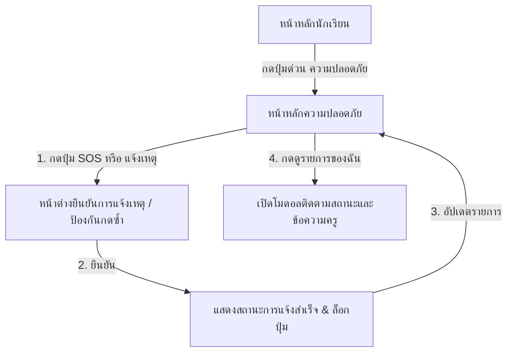

# แผนการพัฒนาหน้าแรกความปลอดภัยห้องเรียน (Student Safety Page Prototype) - [ฉบับปรับลดให้ตรงสเปก MVP]

หน้านี้เป็นส่วนการออกแบบต้นแบบ (UI Prototype) สำหรับโมดูล **"ความปลอดภัยห้องเรียน"** ของนักเรียนในโปรเจกต์ User App โดยสร้างขึ้นแยกเป็นเอกเทศที่ไฟล์ `student_safety_page.dart`

---

## 1. การตรวจสอบความสอดคล้องกับ MVP Scope v1 และ Permission Matrix MVP v1

จากการตรวจสอบร่วมกับสเปกจริงในเอกสาร:
* 📄 [`mvp_scope_v1.md`](file:///Users/sayfa/Documents/AIoT-School-Lab-Vault/MVP-Planning/mvp_scope_v1.md)
* 📄 [`permission-matrix-mvp-v1.md`](file:///Users/sayfa/Documents/AIoT-School-Lab-Vault/MVP-Planning/permission-matrix-mvp-v1.md)

เพื่อหลีกเลี่ยงการหลุดสโคป (Feature Creep) และทำให้ตรงกับ MVP v1 ของระบบจริง:
1. **ตัดฟอร์มแจ้งเหตุแบบละเอียดออกทั้งหมด**:
   * นักเรียน **ไม่มีฟอร์มกรอกข้อความ บันทึกรูปภาพ หรือเลือกประเภทเหตุเอง** ในสเปกจริง
   * ใน MVP v1 การแจ้งเหตุของนักเรียนจะใช้ **"การกดแจ้งเหตุแบบง่ายเพียงคลิกเดียว (One-Tap Emergency Alert / SOS)"** ซึ่งระบบจะตรวจหาพิกัดและห้องเรียนปัจจุบันโดยอัตโนมัติแล้วส่งรหัสแจ้งเตือนทันที
2. **EMG-1 (กดแจ้งเหตุ/ขอความช่วยเหลือ)**:
   * นักเรียนทำได้เพียงกด **"แจ้งเหตุฉุกเฉิน (SOS)"** หรือ **"แจ้งเหตุผิดปกติในห้องเรียน"** ด้วยปุ่มด่วนง่าย ๆ เพื่อขอความช่วยเหลือ
3. **EMG-5 (จัดการ/ปิดเหตุ) & EMG-6 (ติดตามเหตุ)**:
   * นักเรียนทำได้เพียงดูสถานะความคืบหน้าของตนเองแบบ Read-only (`รอครูตรวจสอบ` ➡️ `ครูรับเรื่องแล้ว` ➡️ `กำลังดำเนินการ` ➡️ `ปิดเหตุแล้ว`)
   * ครูเป็นผู้เดียวที่อัปเดตข้อมูลความคืบหน้าและปิดเหตุผ่านระบบฝั่งครู
4. **SEC-X (กล้องวงจรปิด/CCTV)**:
   * นักเรียนไม่มีการเข้าถึงกล้องวงจรปิดเด็ดขาด
5. **ป้ายเตือนระบบจำลอง**:
   * ติดตั้งแถบสีส้ม/แดงเตือนถาวร **"โหมดทดลอง UI — ยังไม่เชื่อมระบบแจ้งเหตุจริง"** เด่นชัดตลอดเวลา

---

## 2. การไหลของหน้าจอที่ปรับลดสโคป (Simplified Screen Flow)

---

## 3. รายละเอียดหน้าจอหลักและปุ่มการทำงาน (Screen Details & Button Actions)

### หน้า 1: หน้าหลักความปลอดภัย (Safety Main Dashboard)
* **ข้อมูลที่แสดง**:
  * **ป้ายเตือนระบบจำลอง (Critical Warning Banner)**: ป้ายเตือนเด่นชัดตลอดเวลา: **"โหมดทดลอง UI — ยังไม่เชื่อมระบบแจ้งเหตุจริง"**
  * **แถบสถานะความปลอดภัยห้องเรียนปัจจุบัน**: แสดงพิกัดห้องเรียน (เช่น `ห้อง ม.5/2, อาคาร 3 ชั้น 5`) และสถานะความปลอดภัย:
    * 🟢 **ปกติ** (ไม่มีเหตุ)
    * 🔴 **มีเหตุ** (กำลังดำเนินการช่วยเหลือ)
  * **ประวัติการแจ้งเหตุของฉัน (My Reports History)**: แสดงเหตุที่นักเรียนคนนี้แจ้งเองเพื่อติดตามสถานะ (ไม่มีฟอร์มกรอกประวัติผู้อื่น)
  * **ประกาศจากโรงเรียน (Active School Alerts)**: แสดงเตือนสั้น ๆ (เช่น *"ซ้อมหนีไฟบ่ายวันนี้"*) พร้อมปุ่ม **"รับทราบ"**
* **ปุ่มกดหลักในการแจ้งเหตุ (One-Tap Report UI)**:
  * 🚨 **ปุ่ม SOS (ขอความช่วยเหลือด่วน)**: ปุ่มสีแดงขนาดใหญ่มีเอฟเฟกต์กระพริบเพื่อใช้แจ้งเหตุทันที
  * ⚠️ **ปุ่มแจ้งเหตุผิดปกติในห้องเรียน**: ปุ่มกดรองสีส้ม สำหรับส่งสัญญาณเตือนกรณีมีสิ่งปกติในห้องเรียนแต่ไม่ถึงขั้นฉุกเฉินร้ายแรง (กดแล้วจะส่งพิกัดห้องเรียนไปที่ห้องครูทันทีโดยไม่ต้องกรอกรายละเอียด)

### หน้า 2: หน้าต่างยืนยันและป้องกันการกดโดนโดยไม่ได้ตั้งใจ (SOS Confirmation Dialog)
* เมื่อกดปุ่ม SOS หรือแจ้งเหตุผิดปกติ:
  * แสดงข้อความยืนยันการส่งสัญญาณขอความช่วยเหลือ
  * ตัวนับเวลาถอยหลัง 3 วินาที (สามารถกดยกเลิกได้ก่อนส่งจริง)
  * เมื่อส่งแล้ว หน้าจอจะล็อกปุ่มไม่ให้กดซ้ำ และแสดงสถานะเด่นชัด: **"ส่งคำขอช่วยเหลือเรียบร้อยแล้ว กรุณาอยู่ในพื้นที่ปลอดภัยและรอการช่วยเหลือจากครู 🚨"**

### หน้า 3: หน้าต่างติดตามสถานะโดยครู (Incident Status Timeline)
* นักเรียนกดที่รายการประวัติของตนเองเพื่อดู Timeline:
  * 📅 **รอตรวจสอบ** (Submitted)
  * 📅 **ครูรับเรื่องแล้ว** (Acknowledged)
  * 📅 **กำลังดำเนินการ** (In Progress)
  * 📅 **ปิดเหตุแล้ว** (Resolved)
* แสดงบันทึกความคืบหน้าของครู (เช่น *"ครูเวรกำลังเดินไปตรวจสอบห้องเรียน"*)

---

## 4. แผนขั้นตอนการสร้างโค้ดและการตรวจความเรียบร้อย (Coding & Verification Steps)

1. **Step 1**: กำหนดโมเดลข้อมูลจำลองแบบเรียบง่าย `MockIncident` ในไฟล์ `student_safety_page.dart`
2. **Step 2**: ออกแบบและสร้าง UI หน้าหลักความปลอดภัย พร้อมแถบเตือนสีแดง **"โหมดทดลอง UI — ยังไม่เชื่อมระบบแจ้งเหตุจริง"** และพิกัดห้องเรียนปัจจุบัน
3. **Step 3**: พัฒนาปุ่มกด One-Tap SOS และปุ่มแจ้งเหตุปกติ เพื่อส่งข้อมูลทันทีโดยไม่มีฟอร์มกรอกข้อความซับซ้อน
4. **Step 4**: สร้าง Dialog ยืนยันการส่งพร้อมแถบนับถอยหลังและการล็อกป้องกัน Double-Tap
5. **Step 5**: ออกแบบโมดอลติดตามสถานะแบบ Timeline ที่อัปเดตข้อมูลจำลองจากฝั่งครูให้อย่างโปร่งใส
6. **Step 6**: ตรวจสอบ responsive บนหน้าจอหลากหลายขนาดเพื่อความยืดหยุ่น และเช็กไวยากรณ์ด้วย `dart analyze`

────────────────────────────────────────────────────────────────────────────────────────────────────────────────────────────────────
