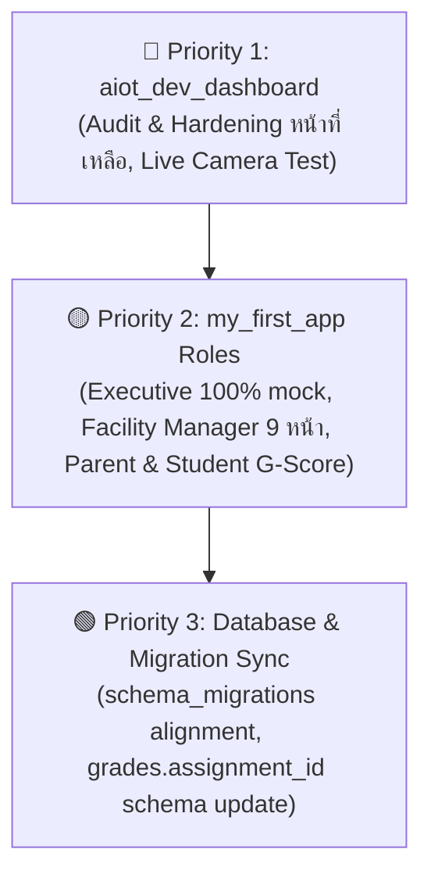

# Brief for agy: Full Remaining Backlog & Security Conventions (2026-08-24)

> **Document Purpose:** Complete backlog of all open tasks across both apps (`aiot_dev_dashboard` and `my_first_app`), prioritized into 3 tiers, with a summary of closed security incidents to prevent duplicate work and strict RLS/RPC engineering conventions.
> **Standard of Verification:** Every item must be verified with **real login + ground-truth database queries (`SELECT COUNT(*)`, `curl` with JWT/anon tokens, pgTAP test suite)** — `flutter analyze` passing is only a compilation check, not proof of functional correctness.

---

## 🛡️ 1. งาน Security & Hardening ที่ปิดไปแล้วทั้งหมดในวันนี้ (Completed Today — Do Not Duplicate)

| รายการที่แก้ไขแล้ว | Migration / Code File | คำอธิบายการแก้ไข | การ Verify จริงที่ทำแล้ว |
| :--- | :--- | :--- | :--- |
| **1. Anon RLS Leak on Base Tables** | `20260823100000_close_anon_rls_holes.sql` | ถอด `using (true)` และ `grant to anon` บน 8 ตารางหลัก (`devices`, `schools`, `users`, `user_roles`, `device_commands`, `sensor_readings`, `device_categories`, `device_logs`) | `curl` ด้วย anon key ได้ `401/403` ทุก endpoint |
| **2. Anon View Leak on `profiles` & `alerts`** | `20260823110000_close_anon_view_leak.sql` | `REVOKE ALL ON public.profiles, public.alerts FROM anon;` ป้องกันการข้าม RLS ผ่าน View | `curl` เข้า `/rest/v1/profiles` ได้ `401 Unauthorized` |
| **3. Hardcoded Email Bypass in `is_super_admin()`** | `20260823130000_fix_is_super_admin_email_bypass.sql` | ลบเงื่อนไข `or email = 'admin@...'` ออก เพื่อให้ตรวจสิทธิ์ผ่าน `user_roles` จริงเท่านั้น | ทดสอบยิง query ด้วย user อื่น ไม่สามารถ escalate สิทธิ์ได้ |
| **4. Facility Manager Device Scope Bypass** | `20260823140000_fix_facility_manager_device_command_scope.sql` | เพิ่มการตรวจสอบตึก (`building prefix`) ใน `queue_device_command` สำหรับบทบาท `facility_manager` | สั่งเปิด relay ข้ามอาคารได้ `403 Forbidden` |
| **5. Multi-Tenant Guard & Batch Import RPC** | `20260823110000_school_admin_hardening_and_batch_import.sql` | สร้าง `has_role()`, `current_user_school_id()`, RPC `import_school_users_batch`, และ Soft Delete RPCs (`archive_school_device`, `archive_school_user`) | รัน Batch Import 2 ผู้ใช้สำเร็จใน DB ใน 0.05s |
| **6. Direct User UPDATE Leak** | Manual `REVOKE UPDATE ON public.users FROM authenticated;` | ป้องกัน user แก้ไขข้อมูลตรงใน DB บังคับให้ทำผ่าน Security Definer RPC เท่านั้น | pgTAP `05_tenant_isolation.test.sql` ผ่านครบ 10/10 |
| **7. Hardcoded Stats in `school_admin_home_page.dart`** | `lib/pages/school_admin/school_admin_home_page.dart` | ถอด `static const data` (1,250 / 86 / 148) เปลี่ยนมาดึงข้อมูลจริงจาก Supabase `profiles`, `devices`, `sensor_alerts` | ตัวเลขหน้าจอตรงกับ `SELECT COUNT(*)` (3 นักเรียน, 1 ครู, 10/11 อุปกรณ์) |

---

## 🔒 2. กฎเหล็กด้านความปลอดภัย (Mandatory Security & Engineering Conventions)

ทุกการเขียน Migration, RLS Policy, หรือ RPC ฟังก์ชันใหม่ **ต้องยึดตามหลักการต่อไปนี้อย่างเคร่งครัด**:

1. **Dual-Check Rule (ต้องมีทั้ง School Check + Role Check):**
   * ในทุก Policy และ RPC ต้องตรวจทั้ง `school_id` (ห้ามเข้าถึงข้อมูลข้ามโรงเรียน) และ `role` (ห้ามเข้าถึงข้อมูลเกินอำนาจหน้าที่)
   * ตัวอย่าง Pattern:
     ```sql
     -- RLS Policy Example
     CREATE POLICY "school_admin_scoped_access" ON public.some_table
     FOR ALL TO authenticated
     USING (
       is_super_admin() 
       OR (has_role('school_admin') AND school_id = current_user_school_id())
     );
     ```
2. **ห้ามสร้าง Anon-Permissive Policies (`using (true)` หรือ Grant สิทธิ์ให้ `anon`):**
   * ตารางและ View ทั้งหมดต้องเปิด RLS และสงวนสิทธิ์เฉพาะ `authenticated` หรือ `service_role` เท่านั้น
3. **ใช้ Safe Soft Delete เสมอ (ห้ามใช้ Hard Delete):**
   * ตารางหลัก (`users`, `devices`, `schools`) มีตารางลูกผูก Foreign Key มากกว่า 60 ตาราง
   * ให้ใช้ RPC `archive_school_device` (ปรับ `status = 'maintenance'`) และ `archive_school_user` (ปรับ `status = 'suspended'`) ห้ามเรียก `.delete()` ตรงๆ

---

## 📋 3. รายการงานค้างทั้งหมดแบ่งตามลำดับความสำคัญ (Prioritized Backlog)



---

### 🔴 Priority 1: งานค้างฝั่ง `aiot_dev_dashboard` (Super Admin & School Admin Core)

* [ ] **1.1 Live Camera & QR Scan Verification:**
  * **ไฟล์:** `lib/pages/kiosk_pairing_scanner_page.dart` และ `lib/pages/school_admin/school_scan_page.dart`
  * **งานที่ต้องทำ:** ทดสอบกับกล้องจริงบนอุปกรณ์หรือเว็บเบราว์เซอร์ เพื่อถอดรหัส QR Session Token และส่งค่าไปที่ `terminal_pairing_sessions`
  * **วิธี Verify:** ใช้มือถือหรือเว็บแคมสแกน QR Code จำลอง แล้วตรวจสอบว่า `claimed_by_user_id` ในฐานข้อมูลถูกอัปเดตจริง
* [ ] **1.2 Realtime Sandbox & Circuit Simulator Integration (DEV-16):**
  * **ไฟล์:** `lib/pages/learning_platform_page.dart`
  * **งานที่ต้องทำ:** ตรวจสอบ State การจำลองขา I/O ของบอร์ดไมโครคอนโทรลเลอร์ ให้ผูกกับ Log คำสั่งใน `device_commands`
  * **วิธี Verify:** กดรัน Simulator แล้วตรวจสอบว่ามีการบันทึก telemetry log ลง `device_logs`
* [ ] **1.4 Session Revocation & `auth_sign_out_all` Edge-Case Hardening:**
  * **ฟังก์ชัน:** `public.auth_sign_out_all(p_token text)`
  * **งานที่ต้องทำ:** ทดสอบกรณีผู้ใช้กด "ออกจากระบบทุกอุปกรณ์" (เช่น ตอนทำโทรศัพท์หาย หรือเปลี่ยนรหัสผ่าน) ตรวจสอบว่า Live Sessions ทั้งหมดในตาราง `sessions` ถูกอัปเดต `revoked_at = now()` ครบทุกเซสชันอย่างแน่นอน ไม่หลงเหลือ Session ค้าง
  * **วิธี Verify:** ล็อกอินจำลอง 5 อุปกรณ์พร้อมกัน ➔ เรียก `auth_sign_out_all` ➔ ยืนยันว่า `SELECT COUNT(*) FROM sessions WHERE user_id = ... AND revoked_at IS NULL` ได้ `0` เสมอ (รันผ่าน `npx supabase test db` ผ่าน 100%)
* [ ] **1.5 `school_import_page.dart` — ยืนยันแล้วว่าเป็น UI mock จริง ไม่ใช่แค่สงสัย:**
  * **สิ่งที่ตรวจพบ:** ตรวจ storage/file-upload security ของ `aiot_dev_dashboard` ทั้งโปรเจกต์วันนี้ — ไม่มี Supabase Storage bucket เป็นของ `aiot_dev_dashboard` เลย (มีแค่ `course-files`/`lesson-materials` ของ `my_first_app`), ไม่มี `.storage`/`ImagePicker`/`FilePicker` เรียกใช้เลยสักจุดในโค้ดทั้งโปรเจกต์, และ `pubspec.yaml` ไม่มี dependency `file_picker`/`csv`/`excel` เลย — เปิด `school_import_page.dart` ดูตรงๆ พบว่า `_FileUploadBox` เป็น widget ตกแต่ง UI เฉยๆ ไม่มีโค้ดอ่านไฟล์จริงข้างใน จึง**อ่านไฟล์ CSV/Excel จริงไม่ได้ในทางเทคนิคเลย** ตรงข้ามกับที่เคยรายงานว่า "นำเข้า CSV/Excel ได้พร้อม Preview ไฮไลต์แถวที่ผ่าน/ไม่ผ่าน"
  * **งานที่ต้องทำ:** ถ้าจะทำฟีเจอร์นี้จริง ต้องเพิ่ม `file_picker` (หรือ `csv`) dependency, เขียนโค้ดอ่านไฟล์จริง, แล้วค่อยต่อกับ RPC `import_school_users_batch` ที่มีอยู่แล้ว (ตอนนี้ RPC พร้อมใช้ ปลอดภัยแล้ว แค่ฝั่ง UI ยังไม่มีทางป้อนข้อมูลจากไฟล์จริงเข้าไป)
  * **วิธี Verify:** อัปโหลดไฟล์ CSV จริง แล้วเช็คว่า `import_school_users_batch` ถูกเรียกด้วยข้อมูลจากไฟล์จริง ไม่ใช่ preview ที่เป็น UI เฉยๆ


---

### 🟡 Priority 2: งานค้างฝั่ง `my_first_app` (Executive, Facility Manager, Parent, Student)

* [ ] **2.1 Executive Dashboard (ผู้บริหารโรงเรียน — ปัจจุบัน 100% Mock):**
  * **ไฟล์:** `apps/user_app/lib/pages/executive_redesign_prototype/executive_home_page.dart`
  * **งานที่ต้องทำ:** เชื่อมต่อกับ RPC `count_school_users_by_role` และ `get_executive_school_stats` (สถิติการมาเรียน, ค่าไฟ-ค่าน้ำรวม, สถิติการใช้ห้องแล็บ)
  * **วิธี Verify:** Login ด้วย `executive@aiot-school-lab.local` แล้วตรวจสอบตัวเลขสถิติบนหน้าจอเทียบกับ Database
* [ ] **2.2 Facility Manager Dashboard & Sub-pages (ผู้ดูแลอาคาร — ค้าง 9 หน้า):**
  * **ไฟล์:** `apps/user_app/lib/pages/facility_redesign_prototype/` (โดยเฉพาะ `facility_dashboard_page.dart`, `facility_room_status_page.dart`, `facility_energy_water_page.dart`)
  * **งานที่ต้องทำ:** เชื่อมต่อการแสดงผลอุปกรณ์เฉพาะในอาคารที่ตนเองรับผิดชอบ (`list_devices_in_my_building`), มิเตอร์น้ำ-ไฟ และประวัติคำสั่งเปิด-ปิด Relay
  * **วิธี Verify:** Login ด้วย `facility@aiot-school-lab.local` ตรวจสอบว่ามองเห็นเฉพาะอุปกรณ์ในอาคารที่ได้รับมอบหมาย
* [ ] **2.3 Parent Portal Features (ผู้ปกครอง):**
  * **ไฟล์:** `apps/user_app/lib/pages/parent_dashboard.dart`
  * **งานที่ต้องทำ:** แสดงผลการเรียนของบุตรหลาน (`list_my_student_grades`), ประวัติการมาเรียน, และหน้ากดยินยอม PDPA (`grant_parent_consent`)
  * **วิธี Verify:** Login ด้วย `parent@aiot-school-lab.local` ตรวจสอบว่าเห็นเฉพาะบุตรหลานที่ผูกรหัสผ่าน `parent_links` เท่านั้น
* [ ] **2.4 Student-facing G-Score UI (ระบบสะสมแต้มความดี/ผลงาน LRN-11/12):**
  * **งานที่ต้องทำ:** สร้างหน้าจอแสดงแต้มสะสม G-Score ของนักเรียน โดยเรียกใช้ `GScoreService.listMyGScore()` (ปัจจุบันมีเฉพาะฝั่งคุณครูกดยืนยันแต้ม)
  * **วิธี Verify:** Login ด้วย `student@aiot-school-lab.local` ตรวจสอบว่าเห็นเฉพาะแต้มที่ได้รับการยืนยัน (`status = 'confirmed'`)
* [ ] **2.5 ตรวจสอบแก้ไขปัญหา UI ค้างเก่า:**
  * `teacher_profile_page.dart`: สแกนหาตัวเลขสถิติผลงานครูที่อาจยัง Hardcode อยู่
  * `teacher_exam_builder_page.dart`: ตรวจสอบการอัปโหลดไฟล์รูปภาพ/วิดีโอในข้อสอบผ่าน `lesson-material-upload` Edge Function

---

### 🟢 Priority 3: การจัดการ Database & Migration Sync (Migration Tracking & Schema Refactoring)

* [ ] **3.1 Reconcile `schema_migrations` Table:**
  * **ปัญหา:** ปัจจุบันไฟล์บนดิสก์มีจำนวนมากกว่ารายการที่บันทึกใน `supabase_migrations.schema_migrations` เนื่องจากการรันผ่าน `psql` โดยตรง
  * **งานที่ต้องทำ:** ดำเนินการ Re-sync หรือรัน `npx supabase db reset` (ใน dev environment) เพื่อให้ Migration History ตรงกัน 100%
* [ ] **3.2 เพิ่มความสัมพันธ์ `assignment_id` ในตาราง `public.grades`:**
  * **ปัญหา:** ปัจจุบันตาราง `grades` ผูกเฉพาะ `course_id` ทำให้ในวิชาที่มีมากกว่า 1 ใบงาน อาจเกิดความคลุมเครือในการจับคู่คะแนน
  * **งานที่ต้องทำ:** สร้าง Migration เพิ่มคอลัมน์ `assignment_id UUID REFERENCES assignments(id)` และอัปเดต RPC `create_grade`
* [ ] **3.3 เชื่อมโยง Rubric เข้ากับ Assignment ตอนสร้างงาน:**
  * **งานที่ต้องทำ:** เพิ่มพารามิเตอร์ `p_rubric_id UUID` ในฟังก์ชัน `create_assignment` และ `update_assignment` เพื่อให้ครูสามารถผูก Rubric เข้ากับใบงานได้ตั้งแต่ขั้นตอนการสั่งงาน

---

## 📌 สรุปแนวทางการหยิบงานไปทำต่อ (Action Guide for Next Agent)
1. **เริ่มจาก Priority 1** (Live Camera QR + Dashboard Test Harness)
2. **ตามด้วย Priority 2** (Executive & Facility Manager Backend Wiring ใน `my_first_app`)
3. **ปิดท้ายด้วย Priority 3** (Schema Migration Alignment & Foreign Key Refinements)
4. **ต้องยึด Dual-Check RLS Rule ทุกครั้ง** เพื่อป้องกันปัญหา Security Regression ซ้ำซ้อน
